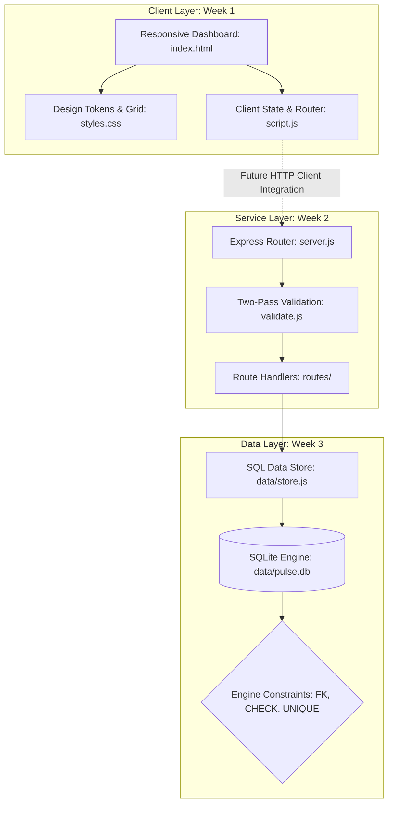
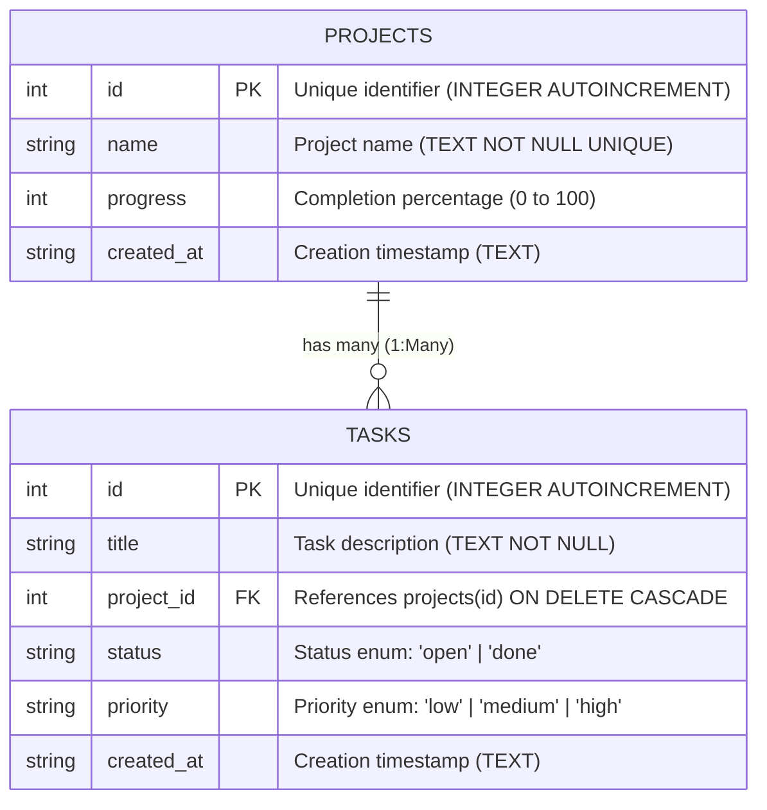

# Pulse — Team Task Dashboard

Pulse is a full-stack task and project management dashboard engineered across three progressive development phases: a responsive client interface, a RESTful backend API, and a persistent relational database integration.

[](./week-1-responsive-frontend)
[](./week-2-backend-api)
[-blue.svg)](./week-3-database-integration)
[](./package.json)

---

## Table of Contents

1. [Architectural Concept](#architectural-concept)
2. [Internship Progress](#internship-progress)
3. [Repository Structure](#repository-structure)
4. [System Architecture](#system-architecture)
5. [Shared Data Model](#shared-data-model)
6. [Technology Stack](#technology-stack)
7. [Running the Projects](#running-the-projects)
8. [Demonstrated Skills](#demonstrated-skills)
9. [Product Roadmap](#product-roadmap)
10. [Author](#author)

---

## Architectural Concept

Pulse was constructed layer by layer to demonstrate the complete lifecycle of modern web application development:

| Application Layer | Core Engineering Question | Development Phase |
| :--- | :--- | :--- |
| **Interface Layer** | How can users interact with tasks and projects cleanly across all devices? | Week 1: Responsive Frontend |
| **Service Layer** | How do client requests get validated, routed, and handled via HTTP? | Week 2: Backend REST API |
| **Persistence Layer** | How does application state survive process restarts while maintaining data integrity? | Week 3: Database Integration |

---

## Internship Progress

| Phase | Project | Core Engineering Focus | Directory Link | Status |
| :--- | :--- | :--- | :--- | :--- |
| **Week 1** | Responsive Frontend | Semantic HTML5, CSS Grid macro layout, fluid `clamp()` typography, vanilla ES6 state, client-side routing, and WCAG AA accessibility | [week-1-responsive-frontend/](./week-1-responsive-frontend) | Complete |
| **Week 2** | Backend REST API | Express REST architecture, route controllers, two-pass syntactic & semantic validation, in-memory store, centralized error handling | [week-2-backend-api/](./week-2-backend-api) | Complete |
| **Week 3** | Database Integration | SQLite integration via `better-sqlite3`, raw SQL prepared statements, foreign key cascade rules, engine-level constraints, conflict resolution | [week-3-database-integration/](./week-3-database-integration) | Complete |

---

## Repository Structure

```
pulse-internship/
├── README.md                      # Root project overview and architecture documentation
├── package.json                   # Root workspace scripts to run each week
├── .gitignore                     # Repository-level ignore rules (node_modules, *.db, logs)
├── week-1-responsive-frontend/    # Week 1: Vanilla HTML5 / CSS3 / ES6 Frontend
│   ├── index.html                 # Semantic markup and native modal dialog
│   ├── styles.css                 # Design tokens, CSS Grid macro layout, fluid typography
│   ├── script.js                  # Client-side state, hash routing, observers, mock auth
│   ├── serve-app.js               # Static HTTP server (port 4173)
│   ├── package.json               # Script definition for frontend runner
│   └── README.md                  # Week 1 technical documentation
├── week-2-backend-api/            # Week 2: Node.js + Express In-Memory REST API
│   ├── server.js                  # Express bootstrap and middleware pipeline
│   ├── package.json               # Express and cors dependencies
│   ├── package-lock.json          # Dependency lockfile
│   ├── .gitignore                 # Component-level ignore file
│   ├── data/
│   │   └── store.js               # In-memory arrays with synchronous CRUD operations
│   ├── middleware/
│   │   └── validate.js            # Two-pass input validation (syntactic + semantic)
│   ├── routes/
│   │   ├── tasks.js               # /api/tasks REST endpoints
│   │   └── projects.js            # /api/projects REST endpoints and nested tasks
│   ├── test.js                    # Automated test suite (21 assertions)
│   └── README.md                  # Week 2 technical documentation
└── week-3-database-integration/   # Week 3: Express API with SQLite Database
    ├── server.js                  # Express bootstrap with database error code mapping
    ├── package.json               # Dependencies (better-sqlite3, express, cors)
    ├── package-lock.json          # Dependency lockfile
    ├── .gitignore                 # Database and dependency ignore rules
    ├── db/
    │   ├── database.js            # Connection manager and PRAGMA foreign_keys = ON
    │   ├── schema.sql             # Relational DDL definitions and constraints
    │   ├── seed.js                # Idempotent database seeder
    │   └── reset.js               # Database wipe and re-seed script
    ├── data/
    │   ├── pulse.db               # SQLite database file (runtime generated)
    │   └── store.js               # Parameterized SQL CRUD store using ? placeholders
    ├── middleware/
    │   └── validate.js            # Validation middleware with database project lookups
    ├── routes/
    │   ├── tasks.js               # Route controllers with error forwarding
    │   └── projects.js            # Route controllers with error forwarding
    ├── test.js                    # Automated test suite (29 assertions)
    └── README.md                  # Week 3 technical documentation
```

---

## System Architecture

The three layers correspond directly to client interaction, HTTP handling, and persistent data storage:



---

## Shared Data Model

The resources shared between the frontend views and backend relational tables:



---

## Technology Stack

| Layer / Component | Technology | Rationale |
| :--- | :--- | :--- |
| **Frontend Markup** | Vanilla HTML5 | Semantic landmarks (`header`, `nav`, `aside`, `main`, `dialog`) maximize accessibility without framework bundle overhead. |
| **Frontend Styling** | Vanilla CSS3 | Named CSS Grid template areas for macro layout, Flexbox for micro components, and custom properties for design tokens. |
| **Frontend Scripting** | Vanilla ES6+ | Zero-dependency DOM event delegation, client-side hash routing, and `IntersectionObserver` animations. |
| **Static Web Server** | Node.js `http` module | Lightweight file server (`serve-app.js`) to test the frontend locally on port 4173 without third-party tooling. |
| **API Runtime** | Node.js + Express | Standardized middleware pipeline for routing, request body parsing, input validation, and error interception. |
| **Database Engine** | SQLite (`better-sqlite3`) | Embedded, serverless C++ driver executing synchronous raw SQL with zero network latency and engine-enforced foreign keys. |
| **Test Automation** | Native Node.js `http` | Zero-dependency HTTP test suite verifying endpoint status codes, validation branches, and database integrity. |

---

## Running the Projects

Each project folder is self-contained and operates independently.

### Running Week 1: Responsive Frontend
```bash
# Navigate to Week 1
cd week-1-responsive-frontend

# Start static file server
npm start
# Alternatively: node serve-app.js
```
The frontend will be available at `http://localhost:4173`.

---

### Running Week 2: Backend REST API (In-Memory)
```bash
# Navigate to Week 2
cd week-2-backend-api

# Install dependencies
npm install

# Start the API server
npm start

# Run automated tests (21 assertions)
npm test
```
The Week 2 API listens on port **3000** (`http://localhost:3000`).

---

### Running Week 3: Database Integration (SQLite)
```bash
# Navigate to Week 3
cd week-3-database-integration

# Install dependencies
npm install

# Start the persistent API server
npm start

# Run automated tests (29 assertions)
npm test

# Reset and re-seed the SQLite database
npm run reset-db
```
The Week 3 API listens on port **3000** (`http://localhost:3000`).

*Important Note on Port Sharing:* Both Week 2 and Week 3 configure port 3000 by default (`process.env.PORT || 3000`). Run only one API server at a time, or override the port on startup:
```bash
PORT=4000 npm start
```

---

## Demonstrated Skills

| Skill Area | Code Implementation Evidence |
| :--- | :--- |
| **Semantic HTML & Accessibility** | Skip-to-content link, native HTML5 `<dialog>` modal, universal `:focus-visible` offset styling, and dynamic `aria-live` announcer regions in [index.html](file:///c:/Users/PC/OneDrive/Documents/Project-1/week-1-responsive-frontend/index.html). |
| **Modern Responsive CSS** | Named CSS Grid layout templates, mobile-first breakpoints, and fluid typography via `clamp()` in [styles.css](file:///c:/Users/PC/OneDrive/Documents/Project-1/week-1-responsive-frontend/styles.css). |
| **Vanilla JavaScript Architecture** | Hash-based client routing, DOM event delegation, modal focus trapping, and `IntersectionObserver` counters in [script.js](file:///c:/Users/PC/OneDrive/Documents/Project-1/week-1-responsive-frontend/script.js). |
| **RESTful Service Design** | Strict HTTP verb mapping, pluralized nouns, nested relationship routes (`/api/projects/:id/tasks`), and proper HTTP status codes in [tasks.js](file:///c:/Users/PC/OneDrive/Documents/Project-1/week-2-backend-api/routes/tasks.js) and [projects.js](file:///c:/Users/PC/OneDrive/Documents/Project-1/week-2-backend-api/routes/projects.js). |
| **Defensive Input Validation** | Two-pass middleware separating syntactic type checks from domain semantic rules in [validate.js](file:///c:/Users/PC/OneDrive/Documents/Project-1/week-2-backend-api/middleware/validate.js). |
| **Relational Database Design** | Primary keys, foreign key constraints with `ON DELETE CASCADE`, `CHECK` boundaries, and indexes in [schema.sql](file:///c:/Users/PC/OneDrive/Documents/Project-1/week-3-database-integration/db/schema.sql). |
| **SQL Injection Prevention** | 100% prepared statement parameterization (`?` placeholders) and dynamic column name whitelist enforcement in [store.js](file:///c:/Users/PC/OneDrive/Documents/Project-1/week-3-database-integration/data/store.js). |
| **Error Handling & Normalization** | Engine-level `UNIQUE` and `FOREIGN KEY` exceptions mapped to `409 Conflict` and `400 Bad Request` in [server.js](file:///c:/Users/PC/OneDrive/Documents/Project-1/week-3-database-integration/server.js). |

---

## Product Roadmap

- [x] **Week 1 Client Interface**: Responsive layout, accessible modal dialogs, and client-side view routing.
- [x] **Week 2 REST API**: In-memory endpoints for tasks and projects with two-pass validation middleware.
- [x] **Week 3 Persistent Storage**: SQLite database integration with prepared statements, foreign key cascades, and automated seeding.
- [ ] **Frontend-to-Backend Connection**: Update `script.js` to replace mock `localStorage` state with real asynchronous `fetch()` API calls to `/api/tasks` and `/api/projects`. *(Note: Week 1 currently operates standalone using internal state and does not yet call the API).*
- [ ] **User Authentication & Authorization**: Session or JWT authentication protecting write operations with role-based permissions.
- [ ] **Rate Limiting & Security Hardening**: Ingress protection with `express-rate-limit` and HTTP response security headers with `helmet`.
- [ ] **Pagination & Sorting**: Support `?page=1&limit=10&sort=priority` query parameters on list endpoints.
- [ ] **Automated End-to-End Testing**: Browser-level automated test suite using Playwright or Cypress.
- [ ] **Production Deployment**: Containerization via Docker and cloud deployment with automated CI/CD workflows.

---

## Author

Built by Thaher as part of the DecodeLabs Full Stack Development internship.