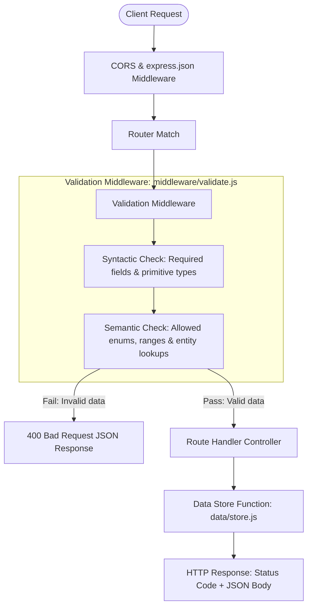
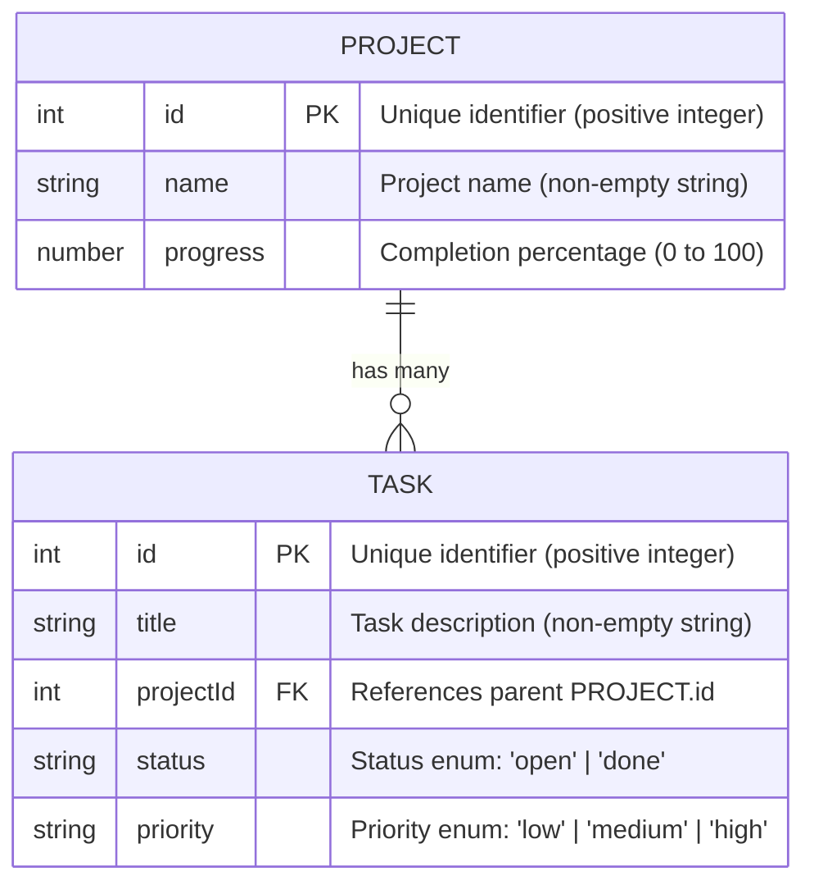
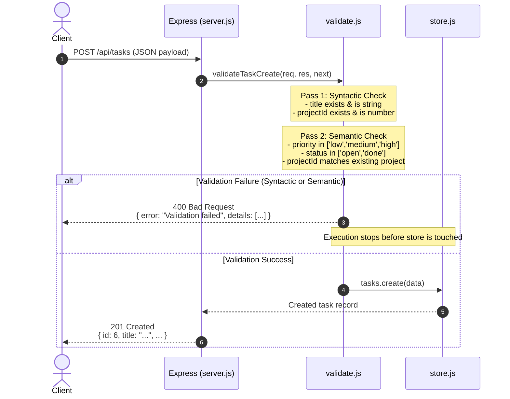

# Pulse API

In-memory RESTful backend API for the Pulse team task dashboard, featuring two-pass validation and modular resource routing.

[](https://nodejs.org/)
[](https://expressjs.com/)
[](./package.json)
[]()

---

## Table of Contents

1. [Overview](#overview)
2. [Architecture Diagram](#architecture-diagram)
3. [Project Structure](#project-structure)
4. [Data Model Diagram](#data-model-diagram)
5. [Getting Started](#getting-started)
6. [API Reference](#api-reference)
   - [Endpoint Quick-Reference](#endpoint-quick-reference)
   - [Tasks Endpoints](#tasks-endpoints)
   - [Projects Endpoints](#projects-endpoints)
7. [Status Code Reference](#status-code-reference)
8. [Validation Flow](#validation-flow)
9. [Roadmap / Next Steps](#roadmap--next-steps)
10. [Screenshots](#screenshots)

---

## Overview

**Pulse API** is a lightweight Node.js and Express backend service designed to power the Pulse team task dashboard. Built as part of **Full Stack Development Week-2 (Project 2: Backend API Development)**, this service is focused strictly on backend fundamentals: clean REST endpoint conventions, modular routing, error handling, and robust input validation. In accordance with the training project scope ("before you scale into complex databases"), data is persisted in a modular in-memory data store (`data/store.js`) isolated from the HTTP layer so it can be swapped for a relational or NoSQL database in future weeks without refactoring route controllers.

> **Validation Principle — "Never Trust the Client":**  
> All incoming write operations are intercepted by validation middleware before touching the data layer. Requests undergo two distinct passes: syntactic verification (presence and data types) followed by semantic verification (valid ranges, accepted enums, and foreign-key referential integrity).

---

## Architecture Diagram

The request lifecycle through the application from client ingress to response dispatch:



---

## Project Structure

```
pulse-api/
├── server.js            # entry point: middleware, routes, error handling
├── routes/
│   ├── tasks.js          # /api/tasks endpoints
│   └── projects.js       # /api/projects endpoints
├── middleware/
│   └── validate.js       # syntactic + semantic validation
├── data/
│   └── store.js          # in-memory data layer
├── package.json
└── README.md
```

---

## Data Model Diagram

The data layer models two core resources where a Project owns many Tasks linked through `projectId`:



---

## Getting Started

Follow these numbered steps to run the API locally:

1. **Verify Prerequisites**  
   Ensure **Node.js** (v18.0.0 or higher) and **npm** are installed:
   ```bash
   node -v
   npm -v
   ```

2. **Navigate to the API Directory**  
   ```bash
   cd pulse-api
   ```

3. **Install Dependencies**  
   Install Express and CORS:
   ```bash
   npm install
   ```

4. **Start the API Server**  
   Start in standard production mode:
   ```bash
   npm start
   ```
   Or run with hot-reload in development mode:
   ```bash
   npm run dev
   ```
   The server will start listening at `http://localhost:3000`.

5. **Run Integration Tests**  
   Execute the automated test suite verifying all 21 assertions across endpoints, status codes, and validation rules:
   ```bash
   npm test
   ```

---

## API Reference

### Endpoint Quick-Reference

| Method | Endpoint | Description | Request Body / Query Params | Status Codes |
| :--- | :--- | :--- | :--- | :--- |
| `GET` | `/api/health` | Health check & uptime status | *None* | `200` |
| `GET` | `/api/tasks` | List all tasks | `?status=open\|done` *(optional)* | `200`, `400` |
| `GET` | `/api/tasks/:id` | Get task by ID | *None* | `200`, `400`, `404` |
| `POST` | `/api/tasks` | Create a new task | JSON `{ title, projectId, status?, priority? }` | `201`, `400` |
| `PUT` | `/api/tasks/:id` | Update an existing task | JSON `{ title?, projectId?, status?, priority? }` | `200`, `400`, `404` |
| `DELETE` | `/api/tasks/:id` | Delete a task by ID | *None* | `204`, `400`, `404` |
| `GET` | `/api/projects` | List all projects | *None* | `200` |
| `GET` | `/api/projects/:id` | Get project by ID | *None* | `200`, `400`, `404` |
| `GET` | `/api/projects/:id/tasks` | Get all tasks for a project | *None* | `200`, `400`, `404` |
| `POST` | `/api/projects` | Create a new project | JSON `{ name, progress? }` | `201`, `400` |
| `PUT` | `/api/projects/:id` | Update a project by ID | JSON `{ name?, progress? }` | `200`, `400`, `404` |
| `DELETE` | `/api/projects/:id` | Delete project and cascade tasks | *None* | `204`, `400`, `404` |

---

### Tasks Endpoints

#### GET /api/tasks
Retrieves all tasks, with optional filtering by status (`open` or `done`).

**Request Example:**
```bash
curl -X GET "http://localhost:3000/api/tasks?status=open"
```

**Response Example (Status: 200 OK):**
```json
[
  {
    "id": 2,
    "title": "Implement OAuth2 social login",
    "projectId": 2,
    "status": "open",
    "priority": "high"
  },
  {
    "id": 4,
    "title": "Optimize database queries for report generation",
    "projectId": 1,
    "status": "open",
    "priority": "medium"
  }
]
```

---

#### GET /api/tasks/:id
Retrieves a single task by its numeric identifier.

**Request Example:**
```bash
curl -X GET http://localhost:3000/api/tasks/1
```

**Response Example (Status: 200 OK):**
```json
{
  "id": 1,
  "title": "Create Figma wireframes for dashboard",
  "projectId": 1,
  "status": "done",
  "priority": "high"
}
```

---

#### POST /api/tasks
Creates a new task. Requires a non-empty `title` and a valid `projectId` corresponding to an existing project.

**Request Example (Success):**
```bash
curl -X POST http://localhost:3000/api/tasks \
  -H "Content-Type: application/json" \
  -d '{
    "title": "Configure automated security scans",
    "projectId": 1,
    "status": "open",
    "priority": "high"
  }'
```

**Response Example (Status: 201 Created):**
```json
{
  "id": 6,
  "title": "Configure automated security scans",
  "projectId": 1,
  "status": "open",
  "priority": "high"
}
```

**Request Example (Validation Failure):**
```bash
curl -X POST http://localhost:3000/api/tasks \
  -H "Content-Type: application/json" \
  -d '{
    "title": "   ",
    "projectId": 9999,
    "priority": "super-urgent"
  }'
```

**Response Example (Status: 400 Bad Request):**
```json
{
  "error": "Validation failed",
  "details": [
    "title must be a non-empty string",
    "Project with projectId 9999 does not exist",
    "priority must be one of: 'low', 'medium', 'high'"
  ]
}
```

---

#### PUT /api/tasks/:id
Updates an existing task by ID with partial or full attributes.

**Request Example:**
```bash
curl -X PUT http://localhost:3000/api/tasks/2 \
  -H "Content-Type: application/json" \
  -d '{
    "status": "done",
    "priority": "low"
  }'
```

**Response Example (Status: 200 OK):**
```json
{
  "id": 2,
  "title": "Implement OAuth2 social login",
  "projectId": 2,
  "status": "done",
  "priority": "low"
}
```

---

#### DELETE /api/tasks/:id
Deletes a task by ID.

**Request Example:**
```bash
curl -X DELETE http://localhost:3000/api/tasks/2 -i
```

**Response Example (Status: 204 No Content):**
```http
HTTP/1.1 204 No Content
```
*(Response body is empty)*

---

### Projects Endpoints

#### GET /api/projects
Retrieves all projects.

**Request Example:**
```bash
curl -X GET http://localhost:3000/api/projects
```

**Response Example (Status: 200 OK):**
```json
[
  {
    "id": 1,
    "name": "Customer Portal Redesign",
    "progress": 75
  },
  {
    "id": 2,
    "name": "Mobile App v2.0",
    "progress": 40
  },
  {
    "id": 3,
    "name": "Cloud Infrastructure Migration",
    "progress": 90
  }
]
```

---

#### GET /api/projects/:id
Retrieves a single project by ID.

**Request Example:**
```bash
curl -X GET http://localhost:3000/api/projects/1
```

**Response Example (Status: 200 OK):**
```json
{
  "id": 1,
  "name": "Customer Portal Redesign",
  "progress": 75
}
```

---

#### GET /api/projects/:id/tasks
Retrieves all tasks associated with a specific project. Returns 404 if the project is not found.

**Request Example:**
```bash
curl -X GET http://localhost:3000/api/projects/1/tasks
```

**Response Example (Status: 200 OK):**
```json
[
  {
    "id": 1,
    "title": "Create Figma wireframes for dashboard",
    "projectId": 1,
    "status": "done",
    "priority": "high"
  },
  {
    "id": 4,
    "title": "Optimize database queries for report generation",
    "projectId": 1,
    "status": "open",
    "priority": "medium"
  }
]
```

---

#### POST /api/projects
Creates a new project record.

**Request Example (Success):**
```bash
curl -X POST http://localhost:3000/api/projects \
  -H "Content-Type: application/json" \
  -d '{
    "name": "Real-time Notification Engine",
    "progress": 15
  }'
```

**Response Example (Status: 201 Created):**
```json
{
  "id": 4,
  "name": "Real-time Notification Engine",
  "progress": 15
}
```

**Request Example (Validation Failure):**
```bash
curl -X POST http://localhost:3000/api/projects \
  -H "Content-Type: application/json" \
  -d '{
    "progress": 140
  }'
```

**Response Example (Status: 400 Bad Request):**
```json
{
  "error": "Validation failed",
  "details": [
    "name is required",
    "progress must be a number between 0 and 100"
  ]
}
```

---

#### PUT /api/projects/:id
Updates an existing project by ID.

**Request Example:**
```bash
curl -X PUT http://localhost:3000/api/projects/1 \
  -H "Content-Type: application/json" \
  -d '{
    "progress": 85
  }'
```

**Response Example (Status: 200 OK):**
```json
{
  "id": 1,
  "name": "Customer Portal Redesign",
  "progress": 85
}
```

---

#### DELETE /api/projects/:id
Deletes a project by ID and cascades deletion to all associated tasks.

**Request Example:**
```bash
curl -X DELETE http://localhost:3000/api/projects/3 -i
```

**Response Example (Status: 204 No Content):**
```http
HTTP/1.1 204 No Content
```
*(Response body is empty)*

---

## Status Code Reference

| Status Code | Name | Trigger Condition / Meaning |
| :--- | :--- | :--- |
| **`200`** | **OK** | Successful `GET` query or successful `PUT` update. Returns the requested resource or list in the response body. |
| **`201`** | **Created** | Successful `POST` write. Returns the newly created resource including its auto-assigned ID. |
| **`204`** | **No Content** | Successful `DELETE` operation. The item was removed; returns an empty body. |
| **`400`** | **Bad Request** | Validation failure. Occurs when required fields are missing, primitive types are invalid, semantic domain rules are violated, `:id` route param is not a positive integer, or JSON syntax is malformed. |
| **`404`** | **Not Found** | The targeted resource ID does not exist in the store, or an unmapped route URL was requested. |
| **`500`** | **Internal Server Error** | Unhandled server exception caught by the centralized 4-argument Express error-handling middleware `(err, req, res, next)`. |

---

## Validation Flow

The sequence diagram below displays the client request pipeline, illustrating the branch between early rejection (400) and data layer persistence (201):



---

## Roadmap / Next Steps

The following features were intentionally excluded from this training milestone ("before you scale into complex databases") and are planned for future iterations:

- **Persistent Database Integration**: Transition from in-memory arrays to PostgreSQL via Prisma ORM or MongoDB via Mongoose.
- **User Authentication & Authorization**: Session-based or JWT authentication with role-based access control (Admin, Lead, Developer).
- **Rate Limiting & Security Headers**: Ingress protection using `express-rate-limit` and `helmet`.
- **API Documentation & Exploration**: Interactive Swagger / OpenAPI UI at `/api/docs`.
- **Automated DB Migrations**: Managed schema versioning and seeding scripts.

---

## Screenshots

<!-- TODO: add screenshot of Postman/curl output here -->
<!--  -->
