# Pulse — Responsive Frontend

Responsive, accessible team task and project management dashboard interface built with vanilla HTML5, CSS3, and JavaScript.

[](https://developer.mozilla.org/en-US/docs/Web/HTML)
[](https://developer.mozilla.org/en-US/docs/Web/CSS)
[](https://developer.mozilla.org/en-US/docs/Web/JavaScript)
[](https://www.w3.org/WAI/WCAG21/quickref/)
[](../package.json)

---

## Table of Contents

1. [Overview](#overview)
2. [Brief vs. Implementation](#brief-vs-implementation)
3. [Breakpoint Flowchart](#breakpoint-flowchart)
4. [Desktop Grid Layout](#desktop-grid-layout)
5. [Design System Tokens](#design-system-tokens)
6. [JavaScript Behavior and Features](#javascript-behavior-and-features)
7. [Accessibility Features](#accessibility-features)
8. [File Structure](#file-structure)
9. [How to Run](#how-to-run)
10. [What I Learned](#what-i-learned)
11. [Navigation](#navigation)

---

## Overview

Week 1 of the Pulse internship focused on engineering a responsive, accessible client-side dashboard interface without external CSS frameworks, UI component libraries, or JavaScript bundlers. The interface delivers an operational overview for software teams, presenting sprint key performance indicators, an interactive task management board, project status progress trackers, and client-side view routing.

---

## Brief vs. Implementation

| Requirement Area | Specification Brief | Implementation in Code |
| :--- | :--- | :--- |
| **HTML5 Semantics** | Semantic landmark structure without excessive `div` nesting | Strict use of `<header role="banner">`, `<nav>`, `<aside>`, `<main>`, `<section>`, `<article>`, and `<footer role="contentinfo">`. Modal dialogs leverage native HTML5 `<dialog>`. |
| **CSS Layout** | CSS Grid for macro layouts, Flexbox for micro components | App layout uses named CSS Grid areas (`header`, `sidebar`, `main`, `footer`). Component interiors (nav items, stat card headers, task rows, filter chips) use CSS Flexbox. |
| **Responsive Strategy** | Mobile-first architecture | Default CSS targets viewports under 768px with single-column layouts and an off-canvas drawer navigation. Media queries progressively enhance layouts at 520px, 768px, 900px, and 1024px. |
| **Fluid Typography** | Fluid scaling without layout thrashing | Core headings and KPI metric numbers use CSS `clamp()` (`clamp(1.4rem, 2.5vw + 0.5rem, 2.1rem)`). |
| **WCAG Accessibility** | WCAG 2.1 Level AA compliance | High contrast ratios exceeding 4.5:1, universal `:focus-visible` offset rings, native `<dialog>` with focus management, ARIA live announcers, and `prefers-reduced-motion` overrides. |

---

## Breakpoint Flowchart

The responsive layout adapts progressively across viewport widths:

```mermaid
flowchart TD
    VP[Viewport Detection] --> Mobile["Mobile (< 768px)"]
    VP --> Tablet["Tablet (768px - 1023px)"]
    VP --> Desktop["Desktop (>= 1024px)"]

    subgraph MobileFeatures [Mobile: Single Column]
        Mobile --> M1[Off-canvas drawer navigation]
        Mobile --> M2[Header search bar hidden]
        Mobile --> M3[Stat cards: 1 column < 520px, 2 columns >= 520px]
        Mobile --> M4[Tasks and Projects stacked vertically]
    end

    subgraph TabletFeatures [Tablet: Progressive Header]
        Tablet --> T1[Header search bar visible with global / shortcut]
        Tablet --> T2[User avatar expands to display full name]
        Tablet --> T3[Two-column dashboard layout >= 900px]
        Tablet --> T4[Drawer remains off-canvas with hamburger toggle]
    end

    subgraph DesktopFeatures [Desktop: Full CSS Grid Template]
        Desktop --> D1["CSS Grid Layout: 260px sidebar + 1fr main"]
        Desktop --> D2[Sidebar locks into static, persistent column]
        Desktop --> D3[Hamburger menu button hidden]
        Desktop --> D4[Side-by-side Tasks 1.15fr and Projects 0.85fr grid]
    end
```



---

## Desktop Grid Layout

On viewports of 1024px and wider, `.app-layout` switches from single-column block flow to a named CSS Grid template:

```
+--------------------------------------------------------------------------+
|                        HEADER (.app-header)                              |
|  [Logo: Pulse]   [Search Input (Hotkey: /)]   [Notifications]  [Profile] |
+------------------------+-------------------------------------------------+
|                        |                  MAIN (.app-main)               |
|                        |  Greeting & Primary "+ New task" CTA            |
|                        |  ---------------------------------------------  |
|   SIDEBAR              |  KPI Stat Cards Grid (4 Columns)                |
|   (.app-sidebar)       |  [Active Tasks] [On Track] [Overdue] [Capacity] |
|                        |  ---------------------------------------------  |
|   - Overview           |  Dashboard Content Grid (1.15fr : 0.85fr)       |
|   - Tasks              |  +--------------------+-----------------------+ |
|   - Projects           |  | Task Board         | Projects Progress     | |
|   - Team               |  | - Filter Chips     | - Client Portal (75%) | |
|   - Reports            |  | - Task Items Check | - Mobile App (40%)    | |
|   - Settings           |  | - Delete Triggers  | - Cloud Infra (90%)   | |
|                        |  +--------------------+-----------------------+ |
+------------------------+-------------------------------------------------+
|                        FOOTER (.app-footer)                              |
|   (c) 2026 Pulse Workspace   [Status: Operational]   [Privacy] [Terms]   |
+--------------------------------------------------------------------------+
```

---

## Design System Tokens

Colors and typography are declared as CSS Custom Properties in `styles.css`:

### Color Palette

| Token Identifier | Hex Code | Role | Contrast / Usage |
| :--- | :--- | :--- | :--- |
| `--color-mocha-mousse` | `#A5856F` | Accent / Secondary Brand | Borders, subtle highlights, active pill indicator |
| `--color-mocha-deep` | `#5D4333` | Primary Action | Buttons, checked checkboxes, primary headings (6.2:1 contrast) |
| `--color-ethereal-blue` | `#A0D4E0` | Interactive Secondary | Focus rings, hover states, active navigation tint |
| `--color-ethereal-deep` | `#1E5C6B` | High-Contrast Accent | Text on ethereal blue tints, active navigation labels (6.5:1 contrast) |
| `--color-moonlit-grey` | `#F2F0EA` | Canvas Background | Warm, low-strain neutral page background |
| `--color-surface` | `#FFFFFF` | Card Surface | Dashboard cards, popovers, dialog container |
| `--color-ink-primary` | `#362B24` | Primary Typography | Body copy and primary section titles (9.6:1 AAA contrast) |
| `--color-ink-muted` | `#6B5D54` | Secondary Typography | Metadata, timestamps, subtitle labels (4.8:1 AA contrast) |
| `--color-state-on-track` | `#205731` | Success / Positive State | Low priority tags, on-track indicators |
| `--color-state-overdue` | `#96351E` | Alert / Warning State | High priority tags, overdue metric indicator |

### Typography Stack
- **Headings & Badges**: `Inter` (weights: `600`, `700`) via Google Fonts.
- **Body & Controls**: `Open Sans` (weight: `400`) via Google Fonts.
- Total weights loaded: 3 font weights across 2 font families.

---

## JavaScript Behavior and Features

All client-side behavior is implemented in `script.js` as an encapsulated, zero-dependency ES6 module:

1. **Client-Side State Management**: A centralized `state` store maintains tasks, authentication state, current view, active filter, and search queries.
2. **Mock Authentication**: Full-screen login overlay with demo credential fill (`alex.rivera@pulse.workspace`), password visibility toggle, session persistence in `localStorage`, and logout routines.
3. **Multi-View Hash Routing**: Client-side hash routing (`#overview`, `#tasks`, `#projects`, `#team`, `#reports`, `#settings`) with browser history support, active sidebar navigation synchronization, and screen-reader announcements.
4. **Accessible Task Modal**: Native HTML5 `<dialog id="new-task-dialog">` with form validation, input sanitization, automated prepend to the task list, and fallback support.
5. **Interactive Task List**:
   - Status toggling with strikethrough styling and live counter decrement/increment.
   - Segmented filter chips: **All**, **Open**, and **Done** with live count badge updates.
   - Real-time search filtering matching titles, priorities, and assignees.
   - Task removal with live toast feedback.
6. **Animated KPI Counters**: `IntersectionObserver` triggers cubic ease-out counting animations on numerical metrics when scrolled into view.
7. **Export Sprint Report**: Generates and downloads an RFC-compliant CSV report directly in the browser.
8. **Keyboard Navigation & Hotkeys**:
   - `/`: Focus search input.
   - `N`: Open new task dialog.
   - `Escape`: Close modals, drawers, and menus.
   - `Alt + 1` to `Alt + 6`: Switch navigation views.
   - `?`: Open keyboard shortcuts cheat sheet.

---

## Accessibility Features

- **Skip Navigation Link**: Hidden `<a href="#main-content" class="skip-link">` allows keyboard users to bypass navigation.
- **Native `<dialog>` Modal**: Traps focus inside the dialog while open and restores focus to the invoking button upon dismissal.
- **ARIA Attribute Synchronization**: `aria-expanded`, `aria-controls`, `aria-haspopup`, and `aria-pressed` attributes update dynamically on toggle actions.
- **Screen Reader Announcements**: An off-screen `#sr-announcer` (`aria-live="assertive"`) provides live auditory feedback when filters change, tasks are completed, or views switch.
- **Motion Preference Honoring**: `prefers-reduced-motion` media query disables animations and smooth transitions for users requesting reduced motion.

---

## File Structure

```
week-1-responsive-frontend/
├── index.html        # Semantic HTML5 layout, accessible landmarks, and native dialogs
├── styles.css        # Mobile-first CSS, custom tokens, Grid macro layout, Flexbox components
├── script.js         # Vanilla ES6 state, routing, DOM manipulation, and observers
├── serve-app.js      # Minimal Node.js HTTP server serving static files on port 4173
├── package.json      # npm start script definition
└── README.md         # Week 1 technical documentation
```

---

## How to Run

### Option 1: Node.js Static Server (Recommended)
From the `week-1-responsive-frontend` directory:
```bash
npm start
```
Alternatively:
```bash
node serve-app.js
```
The application will be served at `http://localhost:4173`.

### Option 2: Direct Browser Access
Open `index.html` directly in any modern web browser:
```bash
# Windows
start index.html

# macOS
open index.html

# Linux
xdg-open index.html
```

---

## What I Learned

1. Structuring responsive macro layouts with CSS Grid (`grid-template-areas`) while using Flexbox for component alignment.
2. Building a complete client-side application architecture with state management and hash-based routing using vanilla JavaScript.
3. Implementing WCAG 2.1 AA accessible patterns including native `<dialog>` modals, ARIA live regions, and keyboard event delegation without third-party frameworks.

---

## Navigation

- **Previous**: [Root Project Overview](../README.md)
- **Next**: [Week 2 — Backend REST API](../week-2-backend-api/README.md)
