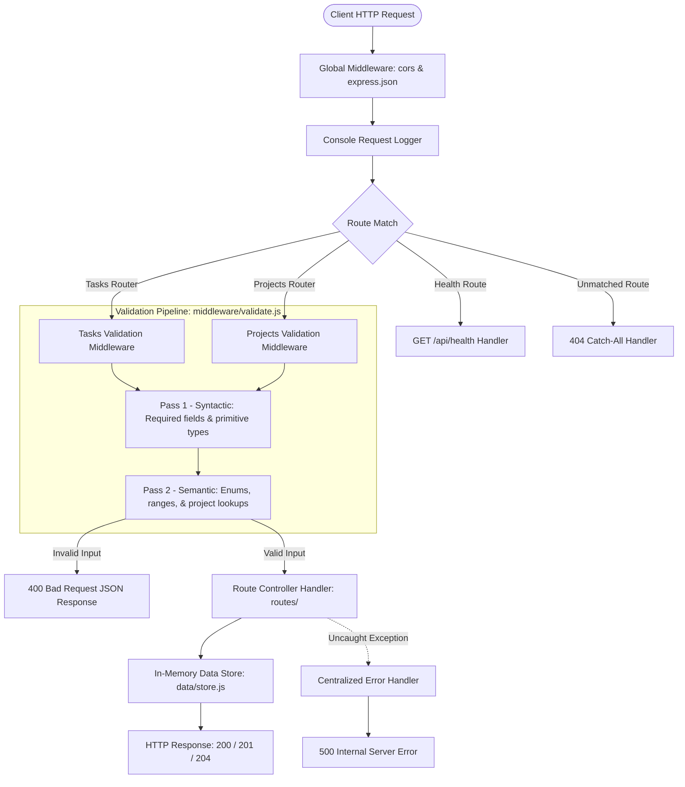
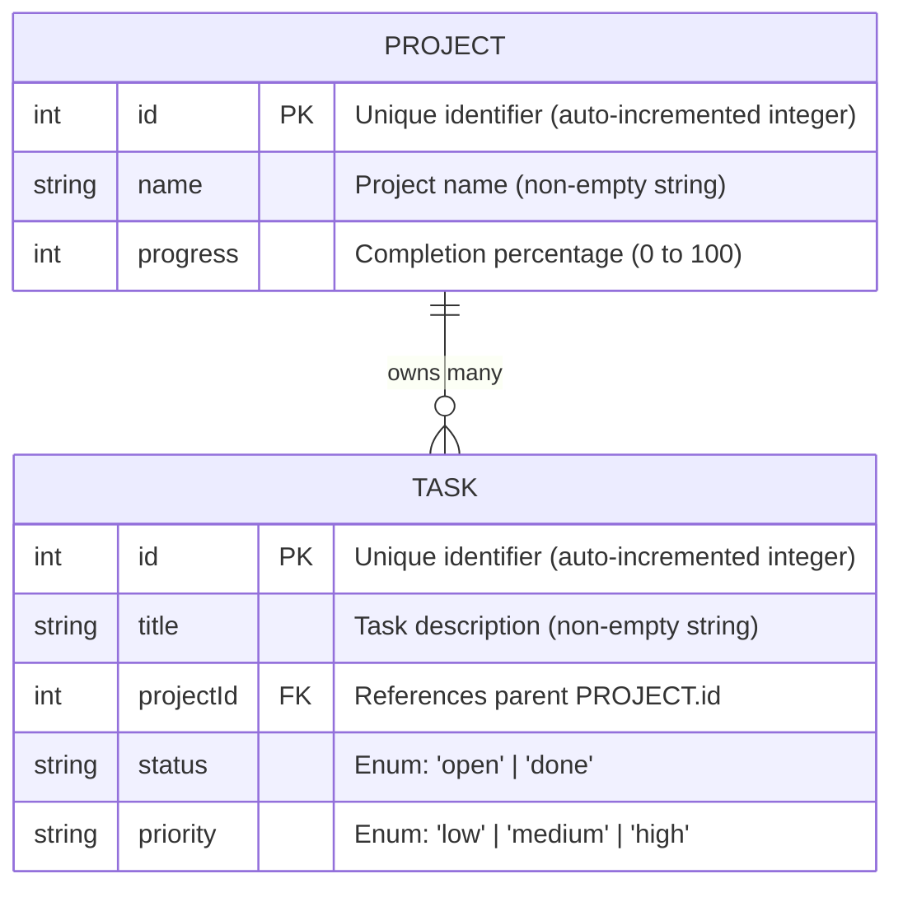

# Pulse — Backend REST API

RESTful backend service for the Pulse team task dashboard, implemented in Node.js and Express with an in-memory data store and two-pass validation middleware.

[](https://nodejs.org/)
[](https://expressjs.com/)
[](./package.json)
[]()

---

## Table of Contents

1. [Overview](#overview)
2. [Request Lifecycle Flowchart](#request-lifecycle-flowchart)
3. [Folder Structure](#folder-structure)
4. [Data Model Diagram](#data-model-diagram)
5. [Getting Started](#getting-started)
6. [API Endpoints Reference](#api-endpoints-reference)
7. [Validation Architecture](#validation-architecture)
8. [Status Code Reference](#status-code-reference)
9. [Tested cURL Examples](#tested-curl-examples)
10. [Limitations](#limitations)
11. [Navigation](#navigation)

---

## Overview

Week 2 of the Pulse internship focused on backend API fundamentals: modular route handling, RESTful URI resource modeling, centralized error interception, and defensive request validation. This service models two resources: `projects` and `tasks`. Data is held in an isolated in-memory data store (`data/store.js`) that abstracts storage logic from HTTP controllers.

---

## Request Lifecycle Flowchart

Every incoming request passes through global middleware, route matching, two-pass validation, controller execution, and the data layer:



---

## Folder Structure

```
week-2-backend-api/
├── server.js              # Application entry point, global middleware, and centralized error handler
├── package.json           # Project metadata, dependencies (express, cors), and run scripts
├── package-lock.json      # Locked dependency tree
├── .gitignore             # Ignores node_modules, logs, and environment files
├── data/
│   └── store.js           # In-memory arrays (projects, tasks) with CRUD helper functions
├── middleware/
│   └── validate.js        # Two-pass input validation middleware (syntactic + semantic)
├── routes/
│   ├── tasks.js           # RESTful route controllers for /api/tasks
│   └── projects.js        # RESTful route controllers for /api/projects and nested /tasks
├── test.js                # Automated HTTP test suite (21 assertions)
└── README.md              # Week 2 technical documentation
```

---

## Data Model Diagram

The in-memory data store defines a 1:Many relationship between Projects and Tasks:



---

## Getting Started

### Installation
From the `week-2-backend-api` directory:
```bash
npm install
```

### Running the Server
Start in production mode:
```bash
npm start
```

Start with auto-reload (development mode):
```bash
npm run dev
```

*Note on Port Configuration:* The server defaults to port **3000** (`process.env.PORT || 3000`). If running concurrently with Week 3, run them one at a time or override the port via environment variable:
```bash
PORT=4000 npm start
```

### Running Automated Tests
Execute the automated test suite:
```bash
npm test
```
*Observed Test Result:* **21 Passed, 0 Failed** (covers health check, CRUD operations, query filters, and validation edge cases).

---

## API Endpoints Reference

The table below lists all endpoints defined in `routes/tasks.js` and `routes/projects.js`:

| HTTP Method | Endpoint | Description | Request Body | Status Codes |
| :--- | :--- | :--- | :--- | :--- |
| `GET` | `/api/health` | Service uptime and status check | *None* | `200` |
| `GET` | `/api/tasks` | List all tasks (optional `?status=open\|done`) | *None* | `200`, `400` |
| `GET` | `/api/tasks/:id` | Retrieve single task by ID | *None* | `200`, `400`, `404` |
| `POST` | `/api/tasks` | Create a new task | `{ title, projectId, status?, priority? }` | `201`, `400` |
| `PUT` | `/api/tasks/:id` | Update an existing task | Partial `{ title?, projectId?, status?, priority? }` | `200`, `400`, `404` |
| `DELETE` | `/api/tasks/:id` | Delete a task by ID | *None* | `204`, `400`, `404` |
| `GET` | `/api/projects` | List all projects | *None* | `200` |
| `GET` | `/api/projects/:id` | Retrieve single project by ID | *None* | `200`, `400`, `404` |
| `GET` | `/api/projects/:id/tasks` | List all tasks belonging to a project | *None* | `200`, `400`, `404` |
| `POST` | `/api/projects` | Create a new project | `{ name, progress? }` | `201`, `400` |
| `PUT` | `/api/projects/:id` | Update an existing project | Partial `{ name?, progress? }` | `200`, `400`, `404` |
| `DELETE` | `/api/projects/:id` | Delete project and cascade tasks | *None* | `204`, `400`, `404` |

---

## Validation Architecture

All write operations (`POST`, `PUT`) and parameter lookups pass through `middleware/validate.js` before reaching controllers:

### 1. Syntactic Validation
- **Required Fields**: `title` and `projectId` must be present on task creation; `name` on project creation.
- **Type Checking**: `title` and `name` must be non-empty strings; `projectId` and `progress` must be numbers.
- **Param Verification**: Route `:id` parameters must be positive integers (`/^\d+$/`).

### 2. Semantic Validation
- **Enums**: `status` must be either `'open'` or `'done'`. `priority` must be one of `'low'`, `'medium'`, or `'high'`.
- **Numeric Ranges**: `progress` must be an integer between `0` and `100`.
- **Referential Integrity**: `projectId` must reference an existing project in the store.
- **Update Payload Requirements**: `PUT` bodies must contain at least one valid updatable field.

---

## Status Code Reference

| Status Code | Meaning | Trigger Scenario |
| :--- | :--- | :--- |
| **`200 OK`** | Request succeeded | Successful `GET` fetch or successful `PUT` update |
| **`201 Created`** | Resource created | Successful `POST` write; returns created object |
| **`204 No Content`** | Deletion succeeded | Successful `DELETE`; returns empty body |
| **`400 Bad Request`** | Validation failure | Missing required fields, type mismatch, invalid enum, or malformed JSON |
| **`404 Not Found`** | Resource missing | Requested `:id` does not exist in store, or unmapped route called |
| **`500 Internal Server Error`** | Unhandled error | Caught by centralized Express error handler |

---

## Tested cURL Examples

### 1. Health Check
```bash
curl -X GET http://localhost:3000/api/health
```

### 2. Retrieve All Tasks Filtered by Status
```bash
curl -X GET "http://localhost:3000/api/tasks?status=open"
```

### 3. Create a Project
```bash
curl -X POST http://localhost:3000/api/projects \
  -H "Content-Type: application/json" \
  -d '{"name": "Infrastructure Upgrade", "progress": 20}'
```

### 4. Create a Task Linked to a Project
```bash
curl -X POST http://localhost:3000/api/tasks \
  -H "Content-Type: application/json" \
  -d '{"title": "Deploy staging cluster", "projectId": 1, "priority": "high", "status": "open"}'
```

### 5. Validation Failure Example (400 Bad Request)
```bash
curl -X POST http://localhost:3000/api/tasks \
  -H "Content-Type: application/json" \
  -d '{"title": "", "projectId": 9999}'
```
*Response:*
```json
{
  "error": "Validation failed",
  "details": [
    "title must be a non-empty string",
    "Project with projectId 9999 does not exist"
  ]
}
```

---

## Limitations

1. **In-Memory Volatility**: Data is stored in JavaScript runtime memory (`data/store.js`). Restarting or crashing the server completely resets data to starter seed records.
2. **No Concurrency / Persistence Guarantees**: State cannot be shared across multiple server instances or cluster processes.
3. **No Authentication**: The API has no user authentication or token-based authorization mechanism.

---

## Navigation

- **Previous**: [Week 1 — Responsive Frontend](../week-1-responsive-frontend/README.md)
- **Next**: [Week 3 — Database Integration](../week-3-database-integration/README.md)
