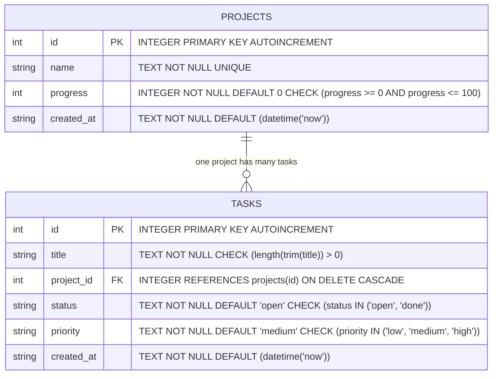

# Pulse — Database Integration

Persistent relational backend service for the Pulse team task dashboard, integrating SQLite via `better-sqlite3`, prepared statements, schema constraints, and transaction-based seeding.

[](https://nodejs.org/)
[](https://expressjs.com/)
[](https://github.com/WiseLibs/better-sqlite3)
[](./package.json)
[]()

---

## Table of Contents

1. [Overview](#overview)
2. [What Changed from Week 2](#what-changed-from-week-2)
3. [Why SQL Was Chosen Over NoSQL](#why-sql-was-chosen-over-nosql)
4. [Relational Schema and Entity Diagram](#relational-schema-and-entity-diagram)
5. [Folder Structure](#folder-structure)
6. [CRUD to HTTP to SQL Mapping](#crud-to-http-to-sql-mapping)
7. [Database Constraints Reference](#database-constraints-reference)
8. [SQL Injection Prevention](#sql-injection-prevention)
9. [Error Handling and Status Code Mapping](#error-handling-and-status-code-mapping)
10. [Getting Started](#getting-started)
11. [Verifying Persistence and Edge Cases](#verifying-persistence-and-edge-cases)
12. [Navigation](#navigation)

---

## Overview

Week 3 of the Pulse internship evolved the Week 2 REST API by replacing the in-memory array store with a persistent relational SQLite database using the native C++ driver `better-sqlite3`. All existing endpoints, route paths, request payloads, response structures, and validation behaviors were preserved, while delegating data longevity, foreign key enforcement, and constraint validation to the database engine.

---

## What Changed from Week 2

| Architecture Aspect | Week 2 (In-Memory Store) | Week 3 (Database Integration) |
| :--- | :--- | :--- |
| **Storage Engine** | JavaScript memory arrays (`let projects = []`, `let tasks = []`) | On-disk SQLite database file (`data/pulse.db`) via `better-sqlite3` |
| **Data Longevity** | Resets completely to starter arrays on server reboot | Persists across process restarts and system reboots |
| **Foreign Key Enforcement** | Manual JavaScript lookup in validation middleware | Enforced by SQLite via `PRAGMA foreign_keys = ON;` and `ON DELETE CASCADE` |
| **Name Uniqueness** | Application-level check or unconstrained | Engine-level `UNIQUE` constraint on `projects.name` |
| **Value Range Enforcing** | Handled solely in validation middleware | Engine-level `CHECK (progress >= 0 AND progress <= 100)` and status/priority enums |
| **Status Codes** | `200`, `201`, `204`, `400`, `404`, `500` | Added **`409 Conflict`** for `UNIQUE` constraint failures |
| **Database Tooling** | None | Schema migration script (`db/schema.sql`), idempotent seeding (`db/seed.js`), and reset command (`npm run reset-db`) |

---

## Why SQL Was Chosen Over NoSQL

For the Pulse task and project management dashboard, a relational SQL engine (SQLite) was selected instead of a document NoSQL store (such as MongoDB):

1. **Relational Domain**: Tasks naturally have a strict 1:Many relationship with Projects. SQL represents this with normalized foreign keys (`project_id`) without duplicating parent project data.
2. **Engine-Enforced Referential Integrity**: With SQLite foreign keys enabled, orphan tasks cannot be created, and deleting a project automatically cleans up all associated tasks via `ON DELETE CASCADE`.
3. **Strict Schema Constraints**: SQL tables enforce `CHECK`, `UNIQUE`, and `NOT NULL` rules directly at the storage level, guaranteeing that invalid data can never enter the database even if application-level checks fail.
4. **Zero-Configuration Serverless Storage**: SQLite operates as a single file (`data/pulse.db`) without requiring external server processes, port configuration, or cloud connection latency.
5. **Raw SQL Simplicity**: Raw SQL via `better-sqlite3` provides clear query visibility without the abstraction overhead or breaking changes of an Object-Relational Mapper (ORM).

---

## Relational Schema and Entity Diagram

The schema is defined in `db/schema.sql` and initialized automatically on application startup:



---

## Folder Structure

```
week-3-database-integration/
├── server.js              # Express entry point, DB bootstrapper, and SQLite error code mapping
├── package.json           # Dependencies (better-sqlite3, express, cors) and reset-db script
├── package-lock.json      # Locked dependency tree
├── .gitignore             # Ignores node_modules, logs, and data/pulse.db artifacts
├── db/
│   ├── database.js        # SQLite connection manager, PRAGMA foreign_keys = ON, schema runner
│   ├── schema.sql         # CREATE TABLE & CREATE INDEX DDL statements with comments
│   ├── seed.js            # Idempotent seed script (runs only if tables are empty)
│   └── reset.js           # CLI script to delete database file and re-seed from scratch
├── data/
│   ├── pulse.db           # Persistent SQLite database file (runtime generated, gitignored)
│   └── store.js           # Parameterized SQL CRUD store mapping DB columns to camelCase
├── middleware/
│   └── validate.js        # Two-pass validation middleware with database project lookups
├── routes/
│   ├── tasks.js           # Route controllers with error forwarding for /api/tasks
│   └── projects.js        # Route controllers with error forwarding for /api/projects
├── test.js                # Integration test suite verifying 29 assertions
└── README.md              # Week 3 technical documentation
```

---

## CRUD to HTTP to SQL Mapping

All operations in `data/store.js` use prepared statements with `?` parameters:

| Resource | Action | HTTP Verb | Endpoint | Store Method | Parameterized SQL Statement | Status Codes |
| :--- | :--- | :--- | :--- | :--- | :--- | :--- |
| **Projects** | List | `GET` | `/api/projects` | `projects.getAll()` | `SELECT id, name, progress, created_at FROM projects ORDER BY id ASC` | `200` |
| **Projects** | Read One | `GET` | `/api/projects/:id` | `projects.getById(id)` | `SELECT id, name, progress, created_at FROM projects WHERE id = ?` | `200`, `404` |
| **Projects** | Nested Tasks | `GET` | `/api/projects/:id/tasks` | `tasks.getByProjectId(id)` | `SELECT id, title, project_id, status, priority, created_at FROM tasks WHERE project_id = ? ORDER BY id ASC` | `200`, `404` |
| **Projects** | Create | `POST` | `/api/projects` | `projects.create(data)` | `INSERT INTO projects (name, progress) VALUES (?, ?)` | `201`, `400`, `409` |
| **Projects** | Update | `PUT` | `/api/projects/:id` | `projects.update(id, data)` | `UPDATE projects SET [whitelisted_cols = ?] WHERE id = ?` | `200`, `400`, `404`, `409` |
| **Projects** | Delete | `DELETE` | `/api/projects/:id` | `projects.remove(id)` | `DELETE FROM projects WHERE id = ?` *(cascades tasks)* | `204`, `404` |
| **Tasks** | List | `GET` | `/api/tasks` | `tasks.getAll(filter)` | `SELECT id, title, project_id, status, priority, created_at FROM tasks [WHERE status = ?] ORDER BY id ASC` | `200`, `400` |
| **Tasks** | Read One | `GET` | `/api/tasks/:id` | `tasks.getById(id)` | `SELECT id, title, project_id, status, priority, created_at FROM tasks WHERE id = ?` | `200`, `404` |
| **Tasks** | Create | `POST` | `/api/tasks` | `tasks.create(data)` | `INSERT INTO tasks (title, project_id, status, priority) VALUES (?, ?, ?, ?)` | `201`, `400` |
| **Tasks** | Update | `PUT` | `/api/tasks/:id` | `tasks.update(id, data)` | `UPDATE tasks SET [whitelisted_cols = ?] WHERE id = ?` | `200`, `400`, `404` |
| **Tasks** | Delete | `DELETE` | `/api/tasks/:id` | `tasks.remove(id)` | `DELETE FROM tasks WHERE id = ?` | `204`, `404` |

---

## Database Constraints Reference

| Constraint Type | Target Table & Column | SQL Definition | Purpose & Enforcement |
| :--- | :--- | :--- | :--- |
| **PRIMARY KEY** | `projects.id`, `tasks.id` | `INTEGER PRIMARY KEY AUTOINCREMENT` | Enforces unique row identification and auto-assigns positive integers. |
| **UNIQUE** | `projects.name` | `TEXT NOT NULL UNIQUE` | Prevents duplicate project names; raises `SQLITE_CONSTRAINT_UNIQUE`. |
| **NOT NULL** | `projects.name`, `tasks.title`, etc. | `NOT NULL` | Guarantees required entity fields cannot be null. |
| **CHECK** | `projects.progress` | `CHECK (progress >= 0 AND progress <= 100)` | Enforces numeric completion percentage boundaries. |
| **CHECK** | `tasks.title` | `CHECK (length(trim(title)) > 0)` | Disallows empty or whitespace-only task titles. |
| **CHECK** | `tasks.status` | `CHECK (status IN ('open', 'done'))` | Restricts lifecycle status strictly to allowed enums. |
| **CHECK** | `tasks.priority` | `CHECK (priority IN ('low', 'medium', 'high'))` | Restricts priority levels to valid domain options. |
| **FOREIGN KEY** | `tasks.project_id` | `FOREIGN KEY (project_id) REFERENCES projects(id) ON DELETE CASCADE` | Enforces parent-child referential integrity; deletes tasks when project is deleted. |
| **INDEX** | `tasks.project_id` | `CREATE INDEX idx_tasks_project_id ON tasks(project_id)` | Optimizes project task lookups and cascade deletion queries. |

---

## SQL Injection Prevention

SQL Injection occurs when user input is concatenated directly into query strings, allowing malicious input to alter query syntax.

### Vulnerable vs. Parameterized Implementation

#### Vulnerable Code (Never Used)
```javascript
// DANGEROUS: Dynamic string interpolation
const query = `UPDATE tasks SET title = '${req.body.title}' WHERE id = ${req.params.id}`;
db.exec(query);

// If req.body.title is: "'; DROP TABLE tasks; --"
// The executed command wipes the tasks table.
```

#### Parameterized Code (Used in Pulse API)
```javascript
// SAFE: Prepared statement using ? placeholders
const stmt = db.prepare("UPDATE tasks SET title = ? WHERE id = ?");
stmt.run(req.body.title, req.params.id);

// If req.body.title is: "' OR 1=1 --"
// SQLite treats the entire string as literal data. The exact text is stored safely.
```

### Dynamic Partial UPDATE Security
In partial updates, column names cannot be parameterized with `?`. To prevent column identifier injection, `data/store.js` filters fields against a strict hardcoded whitelist:
```javascript
const allowedFields = {
  title: { col: "title", transform: (v) => v.trim() },
  projectId: { col: "project_id", transform: (v) => Number(v) },
  status: { col: "status", transform: (v) => v.toLowerCase() },
  priority: { col: "priority", transform: (v) => v.toLowerCase() }
};

for (const [key, config] of Object.entries(allowedFields)) {
  if (updates[key] !== undefined) {
    setClauses.push(`${config.col} = ?`); // Only whitelisted column names inserted
    params.push(config.transform(updates[key])); // User values safely bound
  }
}
```

---

## Error Handling and Status Code Mapping

The centralized error handler in `server.js` translates SQLite database engine exceptions to appropriate HTTP status codes without leaking internal query details:

| SQLite Engine Error / Trigger | Mapped HTTP Code | Client JSON Response Shape |
| :--- | :--- | :--- |
| `SQLITE_CONSTRAINT_UNIQUE` (Duplicate project name) | **`409 Conflict`** | `{"error": "Conflict", "message": "A project with this name already exists"}` |
| `SQLITE_CONSTRAINT_FOREIGNKEY` (Invalid `projectId`) | **`400 Bad Request`** | `{"error": "Bad Request", "message": "projectId does not reference an existing project"}` |
| `SQLITE_CONSTRAINT_CHECK` (Range or enum violation) | **`400 Bad Request`** | `{"error": "Bad Request", "message": "Database check constraint violation: invalid value provided"}` |
| `SQLITE_CONSTRAINT_NOTNULL` (Missing required column) | **`400 Bad Request`** | `{"error": "Bad Request", "message": "Database constraint violation: required field cannot be null"}` |
| Record missing on `GET`, `PUT`, or `DELETE` | **`404 Not Found`** | `{"error": "Not Found", "message": "..."}` |
| Unhandled engine failure / filesystem error | **`500 Internal Server Error`** | `{"error": "Internal Server Error", "message": "An unexpected error occurred on the server"}` |

---

## Getting Started

### Installation
From the `week-3-database-integration` directory:
```bash
npm install
```

### Running the Server
```bash
npm start
```
Development mode with file watching:
```bash
npm run dev
```

*Note on Port Configuration:* The server defaults to port **3000** (`process.env.PORT || 3000`). If running concurrently with Week 2, run one at a time or specify a different port:
```bash
PORT=4000 npm start
```

### Running Automated Tests
```bash
npm test
```
*Observed Test Result:* **29 Passed, 0 Failed** (covers health check, REST CRUD, validation, 409 conflict, SQL injection safety, and ON DELETE CASCADE).

### Database Reset Command
To delete the SQLite database file and re-seed fresh starter records:
```bash
npm run reset-db
```

---

## Verifying Persistence and Edge Cases

### Verifying Persistence Across Restarts

1. **Create a project and task:**
   ```bash
   curl -X POST http://localhost:3000/api/projects \
     -H "Content-Type: application/json" \
     -d '{"name": "Long-Term Persistence Initiative", "progress": 55}'

   # Response returns assigned ID (e.g., id: 4)

   curl -X POST http://localhost:3000/api/tasks \
     -H "Content-Type: application/json" \
     -d '{"title": "Verify data survives restart", "projectId": 4, "priority": "high"}'

   # Response returns assigned task ID (e.g., id: 6)
   ```

2. **Stop and restart the server:**
   - Terminate the running Node.js process (`Ctrl + C`).
   - Start the server again:
     ```bash
     npm start
     ```
   - Notice console output confirms seeding is bypassed:
     `[DB Seed] Database already contains records. Skipping seed to preserve persistent data.`

3. **Verify the data still exists:**
   ```bash
   curl -X GET http://localhost:3000/api/projects/4
   curl -X GET http://localhost:3000/api/tasks/6
   ```
   Both return status `200 OK` with their original persisted attributes.

### Edge-Case Testing Matrix

| Edge Case Test | Request Command / Payload | Expected Status | Observed Result |
| :--- | :--- | :--- | :--- |
| **Duplicate Project Name** | `POST /api/projects` `{"name": "Customer Portal Redesign", "progress": 50}` | `409 Conflict` | `409 Conflict: A project with this name already exists` |
| **Missing Project Reference** | `POST /api/tasks` `{"title": "Orphan", "projectId": 99999}` | `400 Bad Request` | `400 Bad Request: projectId does not reference an existing project` |
| **Invalid Progress Range** | `POST /api/projects` `{"name": "Out of bounds", "progress": 150}` | `400 Bad Request` | `400 Bad Request: progress must be a number between 0 and 100` |
| **Cascade Deletion** | `DELETE /api/projects/1` then `GET /api/tasks/1` | `204 No Content` then `404 Not Found` | Parent deleted; child task removed by `ON DELETE CASCADE` |
| **SQL Injection Payload** | `POST /api/tasks` `{"title": "' OR 1=1 --", "projectId": 2}` | `201 Created` | Stored verbatim as plain text; zero SQL alteration |

---

## Navigation

- **Previous**: [Week 2 — Backend REST API](../week-2-backend-api/README.md)
- **Next**: [Root Project Overview](../README.md)
